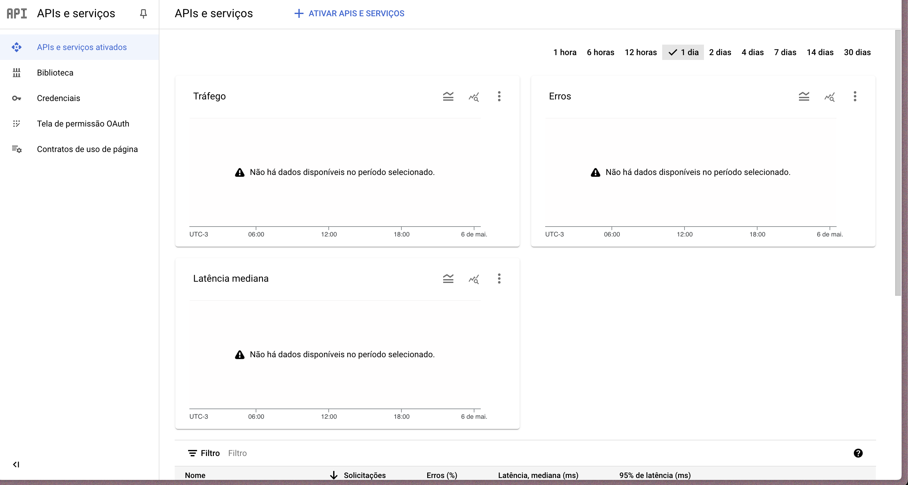
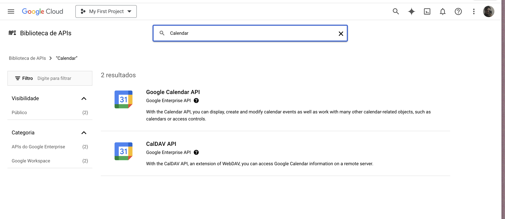
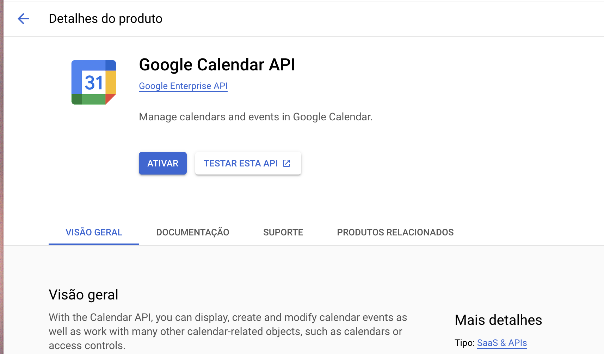
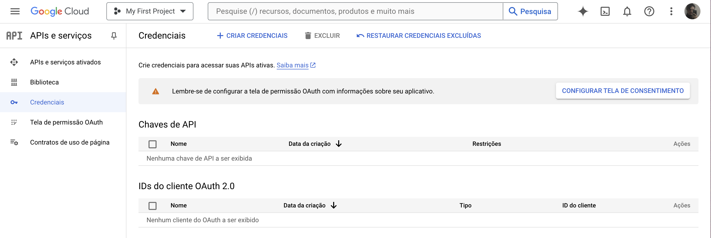
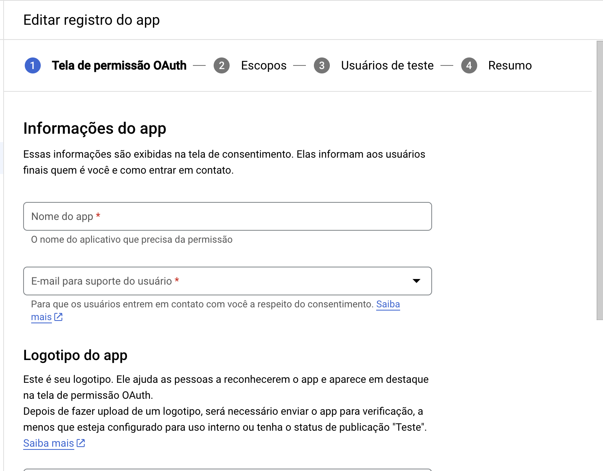
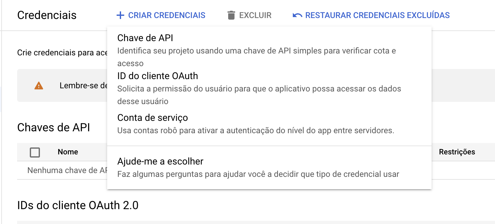
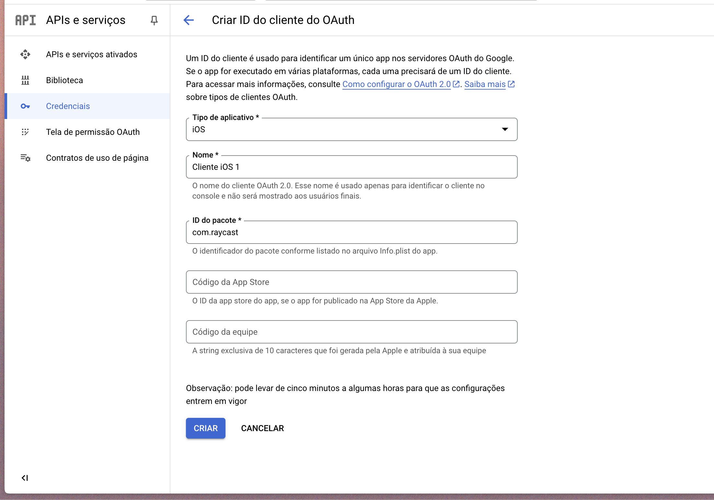
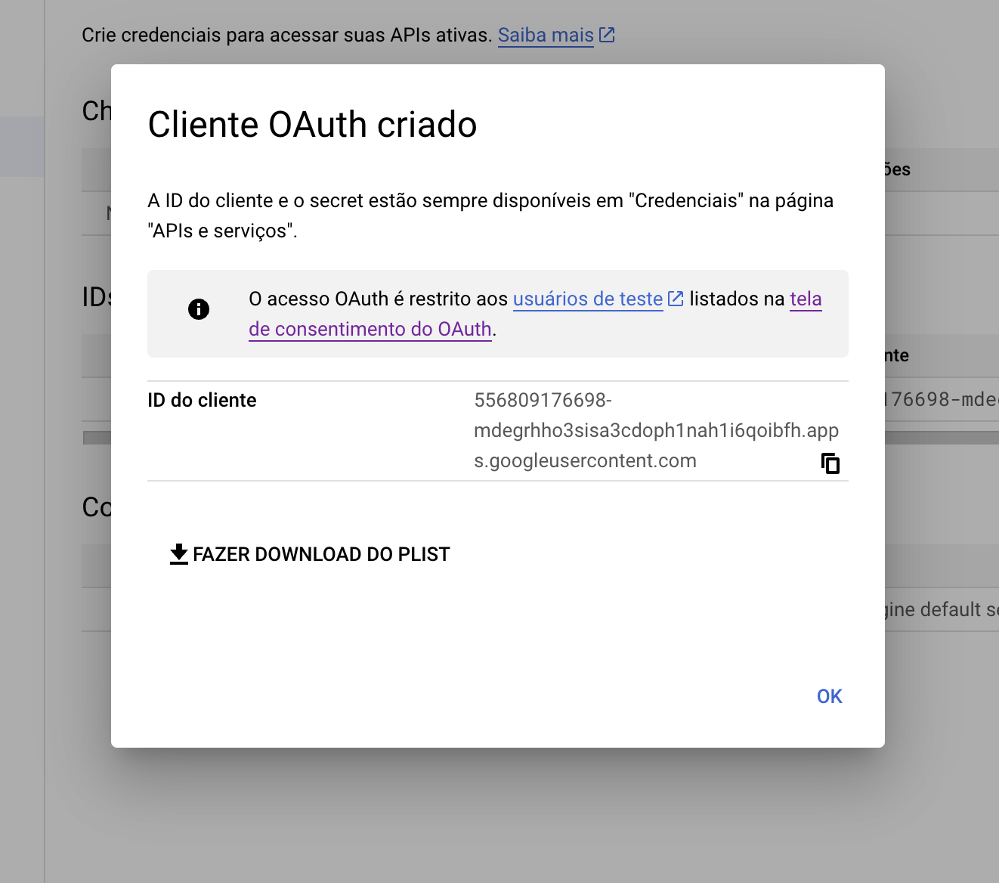

# Raycast Google Calendar

A open-source extension to provide Google Calendar Utilities for [Raycast](https://www.raycast.com/).

## Setup yout OAuth Account:

### Adding Google Calendar Extension:

- Navigate to Google Apis Pages and click in add extension button:

- Search Calendar Api:

- Click in "Google Calendar Api":

- Active the extension.

### Retrieving your OAuth Client Id

- Open your [Google Developer Credentials](https://console.cloud.google.com/apis/credentials) page:

- Setup OAuth Consent:

- Create a new OAuth Client Id:

- Configure your Client Id _(Set bundler id with "com.raycast")_:

- Copy the new OAuth Client Id and use in Google Calendar Extension

# Dont forget to configure your test users, or open your project to all users, linking to this extension raycast page.
